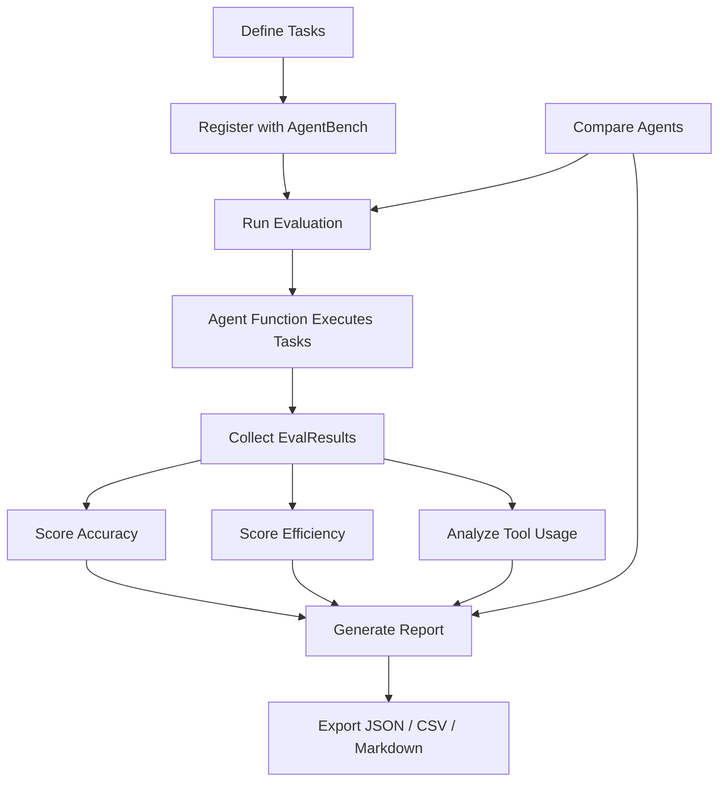

# AgentBench

[](https://github.com/officethree/AgentBench/actions/workflows/ci.yml)
[](https://www.python.org/downloads/)
[](LICENSE)
[](https://github.com/psf/black)

**Agent evaluation and benchmarking suite** for measuring how AI agents actually behave across tasks, tool use, and workflow reliability.

AgentBench is a Python framework for evaluating more than one-shot outputs. It is built for scenarios where you want to understand whether an agent can complete tasks correctly, use tools effectively, and behave consistently enough to trust in real workflows.

---

## Why AgentBench

As agent systems become more capable, the hard part is no longer just generating plausible answers. The harder question is whether an agent can reliably complete work, recover from failure, and perform consistently across tasks that involve tools, steps, and state.

AgentBench exists to make that evaluation more practical.

## What It Measures

AgentBench is designed to help measure:

- task completion quality
- tool-use correctness
- efficiency and step usage
- behavior consistency across runs
- comparative performance across multiple agent implementations

## Architecture



## Quickstart

### Installation

```bash
# Clone the repository
git clone https://github.com/officethree/AgentBench.git
cd AgentBench

# Install in development mode
pip install -e ".[dev]"
```

### Basic Usage

```python
from agentbench import AgentBench, BenchmarkTask

# Initialize the benchmark suite
bench = AgentBench(name="my-eval")

# Register tasks with expected outputs and optional evaluators
bench.register_task(
    name="capital-lookup",
    expected="Paris",
    evaluator=lambda result, expected: result.strip().lower() == expected.lower(),
)

bench.register_task(
    name="math-problem",
    expected="42",
)

# Define your agent function
def my_agent(task: BenchmarkTask) -> str:
    # Your agent logic here
    if task.name == "capital-lookup":
        return "Paris"
    if task.name == "math-problem":
        return "42"
    return ""

# Run evaluation
results = bench.run_evaluation(agent_fn=my_agent, tasks=bench.tasks)

# Score and report
accuracy = bench.score_accuracy(results)
efficiency = bench.score_efficiency(results, max_steps=10)
report = bench.generate_report(results)
print(report)

# Export results
bench.export_results(results, format="json", path="results.json")
```

### Comparing Multiple Agents

```python
def agent_a(task):
    return "Paris" if task.name == "capital-lookup" else "42"

def agent_b(task):
    return "paris" if task.name == "capital-lookup" else "41"

comparison = bench.compare_agents(
    agent_fns={"Agent A": agent_a, "Agent B": agent_b},
    tasks=bench.tasks,
)
print(comparison)
```

## Features

- **Task Registration** — define benchmark tasks with expected outputs and custom evaluators
- **Agent Evaluation** — run any callable agent function against registered tasks
- **Accuracy Scoring** — measure correctness with exact match or custom evaluator functions
- **Efficiency Scoring** — track step counts and time against configurable limits
- **Agent Comparison** — side-by-side evaluation of multiple agents on the same task suite
- **Report Generation** — human-readable Markdown reports with summary statistics
- **Flexible Export** — output results as JSON, CSV, or Markdown

## Who This Is For

- agent builders who want more grounded evals
- teams comparing agent strategies or model providers
- developers building internal benchmark workflows
- researchers exploring practical agent reliability
- anyone trying to move beyond anecdotal agent demos

## Development

```bash
make install    # Install dependencies
make test       # Run tests
make lint       # Run linter
make format     # Format code
make all        # Run lint + test
```

## Project Structure

```
AgentBench/
├── src/agentbench/
│   ├── __init__.py        # Public API exports
│   ├── core.py            # AgentBench class, BenchmarkTask, EvalResult
│   ├── config.py          # Configuration and defaults
│   └── utils.py           # Scoring functions, formatting helpers
├── tests/
│   └── test_core.py       # Unit tests
├── docs/
│   └── ARCHITECTURE.md    # Architecture documentation
├── .github/workflows/
│   └── ci.yml             # CI pipeline
├── pyproject.toml          # Project metadata and dependencies
├── Makefile                # Development commands
├── LICENSE                 # MIT License
└── README.md               # This file
```

---

Inspired by AI agent evaluation trends.

---

Built by **Officethree Technologies** | Made with love and AI
